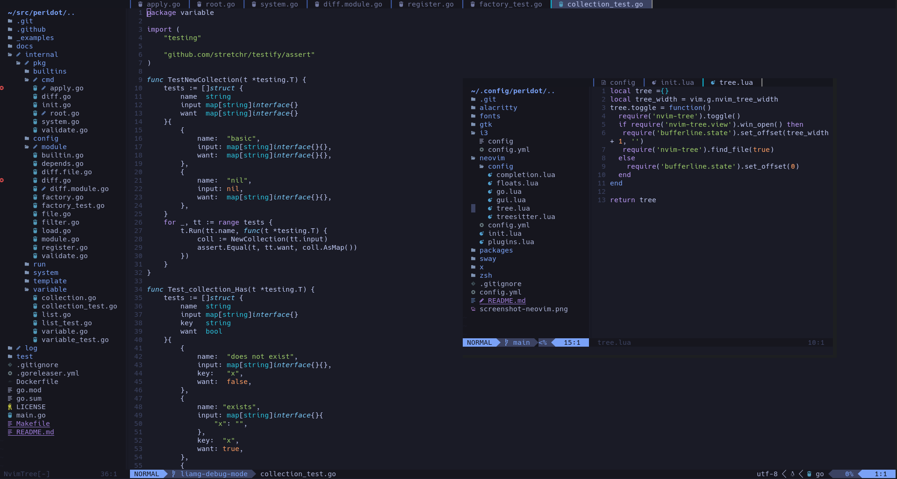

# My Peridot Config

These are my personal dotfiles, managed with [peridot](https://github.com/liamg/peridot).

## Neovim 

### GUI

| binding      | |
|--------------|-|
| `<leader>n`  | Toggle file tree
| `<A-,>`      | Previous buffer
| `<A-.>`      | Next buffer
| `<A-c>`      | Close buffer
| `<A-z>`      | Close all but current buffer
| `<C-p>`      | Magic pick buffer
| `<C-e>`      | Close floating window
| `<leader>j`  | Open terminal
| `<Esc>`      | Close terminal

### Git

| binding      | |
|--------------|-|
| `<leader>hb` | Git blame line

### Code Actions

| binding      | |
|--------------|-|
| `<leader>ca` | Trigger marked code action |

### File Tree

See https://github.com/kyazdani42/nvim-tree.lua#default-actions

### Go

| binding      | command    |   |
| ------------ | ---------- | - |
| `<C-]>`      | | Go to definition |
| `<C-o>`      | | Go back  |
| `gi`         | | Go to implementation |
| `gr`         | | Go to references |
| `<leader>gc` |            | Generate comment
|              | GoLint     | Lint
| `<leader>gt` | GoAddTag   |             
|              | GoRmTag    |             
|              | GoClearTag |             
|              | GoImpl     | cursor on struct, run`:GoImpl [interface]`
| `<leader>fs` | GoFillStruct | auto fill struct                                              |
| `<leader>fS` | GoFillSwitch | fill switch                                                   |
| `<leader>ie` | GoIfErr      | Add if err                                                    |
| `<leader>fp` | GoFixPlurals | change func foo(b int, a int, r int) -> func foo(b, a, r int) |

#### Testing

| binding      | command                  | Description                                             |
| ------------ | ------------------------ | ------------------------------------------------------- |
| `<leader>tt` | GoTest                   | go test ./...
| `<leader>tf` | GoTestFunc               | run test for current func                               |
|              | GoTestFunc -tags=yourtag | run test for current func with `-tags yourtag` option   |
| `<leader>tF` | GoTestFile               | run test for current file                               |
|              | GoTestFile -tags=yourtag | run test for current folder with `-tags yourtag` option |
| `<leader>tp` | GoTestPkg                | run test for current package/folder                     |
|              | GoTestPkg -tags=yourtag  | run test for current folder with `-tags yourtag` option |
| `<leader>ta` | GoAddTest                |                                                         |
|              | GoAddExpTest             | Add tests for exported funcs                            |
| `<leader>tA` | GoAddAllTest             | Add tests for all funcs                                 |

#### Debugging

| binding      | command          | Description                                      |
| ------------ | ---------------- | ------------------------------------------------ |
| `<leader>dd` | GoDebug          | start debug session                              |
| `<leader>dt` | GoDebug test     | start debug session for go test file             |
| `<leader>dr` | GoDebug restart  | restart debug session for go test file           |
| `<leader>dn` | GoDebug nearest  | start debug session for nearest go test function |
| `<leader>ds` | GoDebug stop     | stop debug session and unmap debug keymap        |
| `<leader>db` | GoBreakToggle    |                                                  |
| `<leader>dB` | GoBreakCondition | conditional break                                |
|              | GoDbgStop        | Stop debug session, same as GoDebug stop         |

###### Once debugging has started...

| Binding           | |
|-------------------|-|
| `c` |	continue
| `n` |	next
| `s` |	step
| `o` |	stepout
| `S` |	cap S: stop debug
| `u` |	up
| `D` |	cap D: down
| `C` |	cap C: run to cursor
| `b` |	toggle breakpoint
| `P` |	cap P: pause
| `p` |	print, hover value (also in visual mode)
